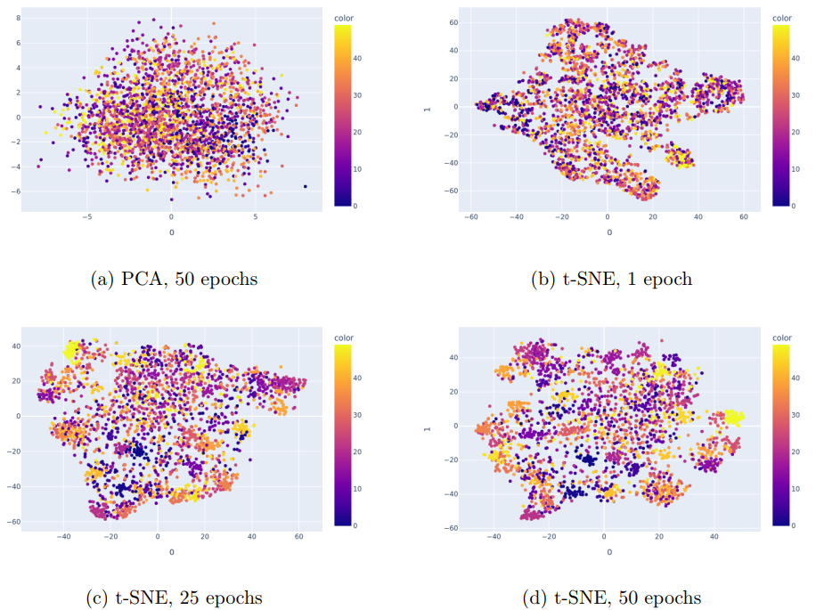
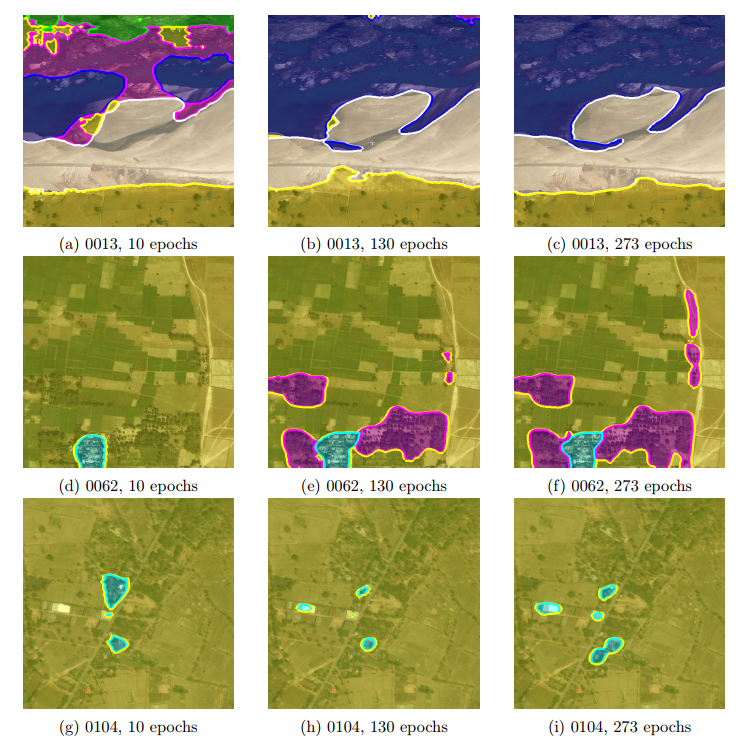

# Image Classfication & Segmentation

This repository implements image classification and segmentation. The image classification model is based on ConvNeXt and achieves accuracy 0.9052 on a dataset with 50 classes. The backbone of the segmentation model is VGG16-FCN32, with pretrained weights available on [Pytorch](https://pytorch.org/vision/stable/models/generated/torchvision.models.segmentation.fcn_resnet101.html#torchvision.models.segmentation.FCN_ResNet101_Weights). After finetuning, the model attains mIOU score 0.7425 on satelitte images. For more details, please refer to the [slides](https://docs.google.com/presentation/d/1lXkZrUrV209kMSGn6Lg37rno0Kp_zbdyxOl0K8F9U_E/edit?usp=sharing) or the [report](./hw1_r11922163.pdf).

# Download Checkpoint
```
bash hw1_download.sh
```

# Image Classification

## Training
```
python classify.py \
    --train \
    --model-name convnext \
    --train-dir /path/to/train/data \
    --val-dir /path/to/val/data \
    --pretrained \
    --opt sgd \
    --lr 0.01 \
    --scheduler cosine \
    --weight-decay 2e-4 \
    --label-smoothing 0.1 \
    --num-epochs 20 \
    --batch-size 32 \
    --accum-step 4 \
    --augment auto
```
Model checkpoints and logs would be saved in `ckpt/p1`.

## Testing
```
bash hw1_1.sh /path/to/test/data /path/to/output.csv
```

## Feature Visualization
The figures illustrate the extracted feature before the linear projection head. we can observe that PCA might not be a proper choice for feature visualization in this case. On the contrary, t-SNE shows that the model is actually learning how to differentiate the images. 



# Image Segmentation

## Training
```
python segment.py \
    --train \
    --train-dir /path/to/train/data \
    --val-dir /path/to/val/data \
    --model-name fcn-resnet101 \
    --loss focal-dice \
    --lr 0.005 \
    --scheduler linear \
    --weight-decay 2e-4 \
    --num-epochs 500 \
    --batch-size 4 \
    --accum-step 16 \
    --validate-step 1000 \
    --crop-resize
```
Model checkpoints and logs would be saved in `ckpt/p2`.

## Testing
```
bash hw1_2.sh /path/to/test/data /path/to/output/dir
```

## Examples
